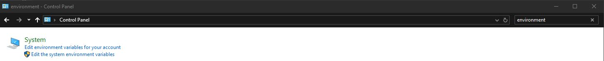
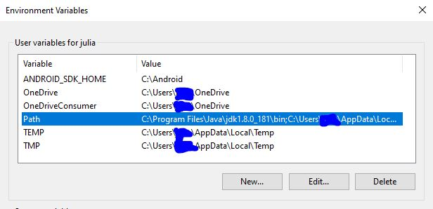
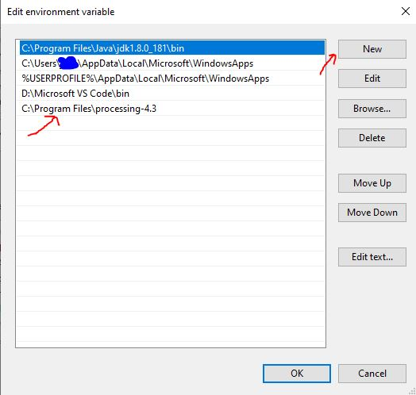

# Roboexotica_IND22

This is a project by **Students of Interaction Design at FH Joanneum**.

---

## Setting Up the Project

### Windows 8 and 10

#### 1. Install Processing
1. Download Processing from the [official website](https://processing.org/download/).
2. Unzip the downloaded file.
3. Move the unzipped content to the **Program Files** directory

#### 2. Add Processing to Environment Variables
Sometimes, you need to manually set the path for `processing-java` in your environment variables:

1. Open the **Control Panel** and search for **Environment Variables**.
2. Click on **Edit the system environment variables**.
3. In the **System Properties** dialog, click **Environment Variables**.
4. Under the **User Variables** section, find and select **Path**, then click **Edit**.
5. Add the path to the folder containing `processing-java.exe`:
6. Click **OK** to save your changes.

> **Note:** If you already have an IDE like VS Code open, you need to restart it for the changes to take effect.

---

### Download Reactivision and the `tuio-processing` Library
1. Download Reactivision from [https://reactivision.sourceforge.net/](https://reactivision.sourceforge.net/).
2. Unzip Reactivision. It can be run from any directory, so you can leave it in the **Downloads** folder or move it elsewhere.

3. Download the `tuio-processing` library:
- Unzip the library.
- Move its contents to your **Processing sketchbook folder** (usually located in `Documents/Processing/libraries`).

---

### Using VS Code
If you're using VS Code, make sure to install the **Processing plugins** to enable support for Processing sketches.

---

### Additional Notes
- Ensure you restart your IDE after setting up the environment variables.
- Check that the `tuio-processing` library is properly placed in the `libraries` folder of your sketchbook.

---

# Starting the Roboexotica_IND22 Project

To run this project, follow these steps:

---

## Steps to Start the Project

### 1. Start Reactivision
- Locate the **Reactivision** application you downloaded earlier.
- Launch it by running the executable file.

### 2. Start the Processing Sketch
- Open the `Roboexotica_IND22.pde` file in Processing or your preferred IDE (e.g., VS Code with Processing plugins).
- Run the sketch.

---

## Notes
- Ensure Reactivision is running **before** starting the Processing sketch.
- Verify that the `tuio-processing` library is correctly installed in your Processing libraries folder.

---
